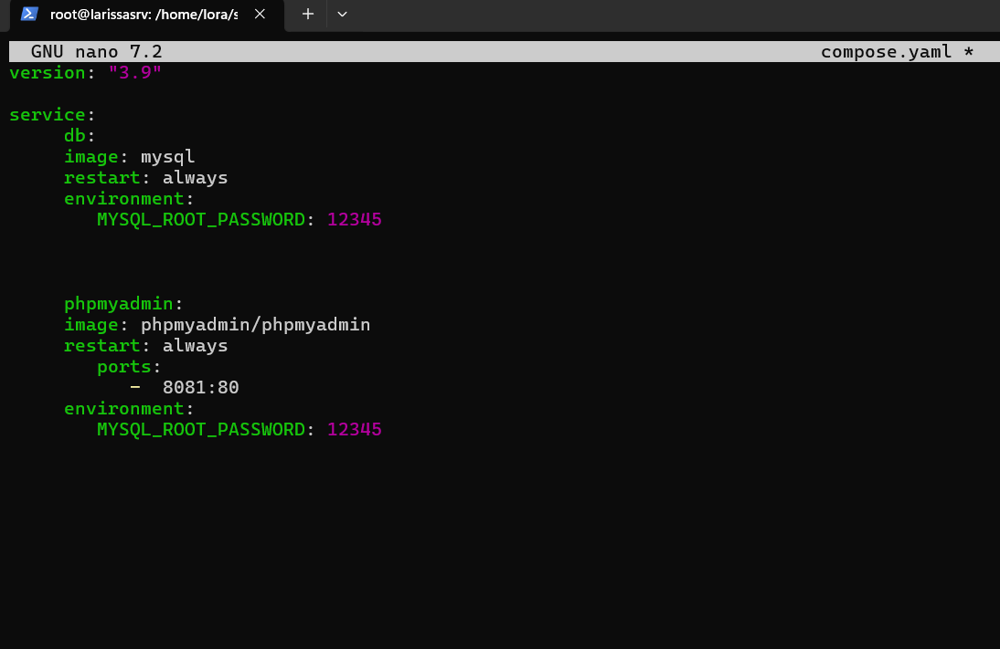

# Урок 5. Docker Compose и Docker Swarm
Задание 1:
1) создать сервис, состоящий из 2 различных контейнеров: 1 - веб, 2 - БД
2) далее необходимо создать 3 сервиса в каждом окружении (dev, prod, lab)
3) по итогу на каждой ноде должно быть по 2 работающих контейнера
4) выводы зафиксировать

Задание 2*:
1) нужно создать 2 ДК-файла, в которых будут описываться сервисы
2) повторить задание 1 для двух окружений: lab, dev
3) обязательно проверить и зафиксировать результаты, чтобы можно было выслать преподавателю для проверки

Задание со звездочкой - повышенной сложности, это нужно учесть при выполнении (но сделать его необходимо).

 ## Решение

1.Для начала проверяем наши контейнеры (они должны быть запущены)

docker run --name larissa-mysql -e MYSQL_ROOT_PASSWORD=my-secret-pw -d mysql:latest

docker run --name myphp -d --link some-mysql:db -p 8081:80 phpmyadmin/phpmyadmin

2. Coздадим docker-compose файл через nano
 

3. Запускаем наш docker-compose, и скачается adminer
 
 docker compose up -d

4. Проверяем что у нас получилось

 
  

5 . Также командой можно проинспектировать наш контейнер и получить всю ин-цию о нем. Например_ adminer

docker container inspect root_adminer 1

5. При попытке инициализации получили ошибку и пришлось покинуть кластер

6. Повторно проводим инициализацию и получаем следующую команду

.png)

7. Смотрим какие сети есть и создаем свою. Например: test-network

.png)

8. теперь проверим, что контейнеры запущены на разных нодах кластера, могут общатся через эту сеть

.png)

9. Пингуем наши контейнеры на то как они друг друга видят 

.png)

10 . Cоздаем сервисы

11. в созданом сервисе можно проверить кол-во контейнеров и ноды

docker service ps adminer_service

12. в запущенном сервисе можем испектировать ноды

и тд.
